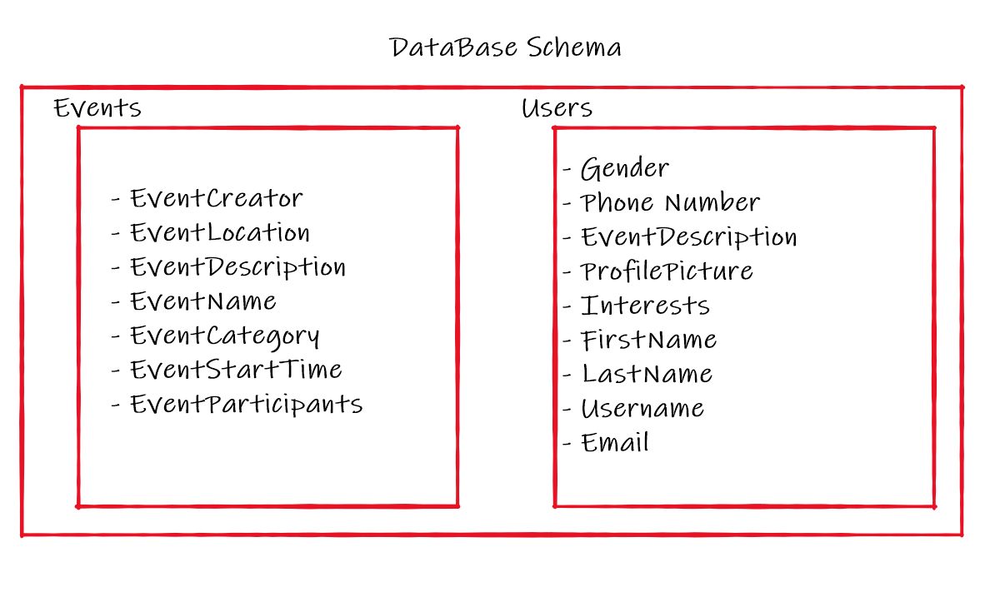

# Requirments

## USER STORIES: 
- As a user, I want to be able to explore events that match my interests, so that I can participate in them.
- As a user, I want to be able to view my activity and other poeple's activity, so that I get a better idea about the poeple I am participating with. 
- As a user, I want to be able to create events with specific categories, so that poeple who are interested in these categories can participate in these events.
- As a user, I want to find poeple who have common intrests with me, so that I can connect with them.
- As a user, I want to be able to contact other users, so that I can make new friends and plan events with them.

## Vision

Our app is built for those who want to find positive company of new friends who share similar interests, to do activities together. This is a perfect time for such a product because many people are feeling alone after the pandemic, and want to bring back social engagement to their lives. 
This is a problem that is very common now, and the app will be successful in solving it. 
  
## Scope 
  
•	IN 

The app will allow to create an account for each user.
It will let the user specify his interests, and it will display events related to those interests.
It will allow the users to create events. 
It will allow the user to join other events.
It will allow the user to find, add and contact friends

•	OUT 

The app will not allow the user to post anything other than events, the goal is to encourage going to the outside world.
  
## Stretch
  
To make using the app safer and more convenient, there will be feedback system about each member who participated in the group, and according to that, it will give the user badges that show on his profile.
Make profile designs customizable, so the users will be more attached and encouraged to use the app.
  
  
## Functional Requirements

1.	The user can create an account one time using his email
2.	The user can create new events
3.	The user can explore and join existing events
4.	The user can explore friends
5.	He can add friends and delete them
6.	He can contact friends 

## Database Schema

